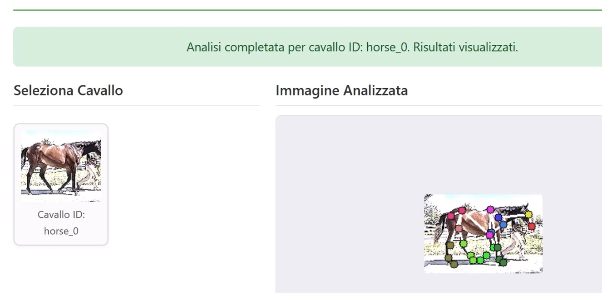

# RHDA - Race Horse Deep Analysis 🐎📊

### Advanced Biomechanical Analysis System for Equine Sports
**From Video to Objective Skeletal Metrics in Real-Time.**



## 🧬 The Core Philosophy: Structure over Surface

**Why a custom solution? Why not use generic animal pose estimation models?**

Standard "State-of-the-Art" Computer Vision models track cutaneous keypoints (visible markers on skin/fur). In high-performance athletes, this data is noisy and unreliable due to:
* Muscle flexion and soft tissue movement.
* Variable lighting and coat patterns.
* Dynamic perspective changes at high speeds (60 km/h).

**RHDA changes the paradigm.**
Instead of tracking the surface, this system is engineered to estimate the **Anatomical Joint Centers (AJC)**—the true internal centers of rotation.

* **Objective:** Measuring the immutable skeletal structure, not the changing muscle mass.
* **Precision:** A proprietary Biomechanical Correction Engine filters the raw neural inference to deliver rigid-body metrics suitable for veterinary and performance analysis.

---

## 🏗 Distributed Microservices Architecture

This repository hosts the **Frontend Client**, a lightweight, dependency-free interface acting as the control center. The heavy lifting is orchestrated via a sequential pipeline of Python microservices hosted on Hugging Face Spaces:

### 1️⃣ MS1: Intelligent Pre-processing & Quality Gate
* **Tech:** YOLOv8 (Custom Trained) + RemBG.
* **Function:** Acts as a semantic filter. Instead of processing every frame blindly, it scans the footage to identify, isolate, and validate only the subjects that meet biomechanical evaluability criteria (lateral view, non-occluded). It prevents "Garbage In, Garbage Out".

### 2️⃣ MS2: Deep Skeletal Inference
* **Tech:** DeepLabCut (Heavily Fine-Tuned).
* **The "Alpha":** Standard models failed on racehorses (crossing legs, jockey occlusion). I curated a custom dataset of high-speed race footage and performed 30+ hours of fine-tuning on Kaggle GPUs.
* **Result:** Robust tracking of 22 deep anatomical points even in chaotic racing environments.

### 3️⃣ MS3: The Biomechanical Engine (The "Brain")
* **Tech:** Pure Python / NumPy / Geometric Algorithms.
* **Function:** This module runs after the AI. It takes the probabilistic tensor output from MS2 and applies geometric constraints to:
    * Correct soft-tissue artifacts.
    * Calculate Anatomical Angles (Hock, Stifle, Fetlock).
    * Compute Skeletal Efficiency Index (0-100 rating).
    * Generate symmetry and stride metrics.

---

## 💻 Frontend Features (This Repo)

The interface demonstrates advanced client-side engineering without heavy frameworks:
* **Vanilla JavaScript:** Clean, performant, and close to the metal.
* **Real-time Synchronization:** Maps complex JSON inference data to HTML5 Video frames with millisecond precision.
* **Canvas Overlay API:** Dynamic rendering of the skeletal rig directly on the video stream.
* **Async Task Management:** Handles long-running inference jobs via robust polling mechanisms.

---

## 🚀 Getting Started

This project is the Client Interface. To see it in action:

1.  **Clone the repository:**
    ```bash
    git clone [https://github.com/FUNFACTOR1/RHDA-Race-Horse-Deep-Analysis.git](https://github.com/FUNFACTOR1/RHDA-Race-Horse-Deep-Analysis.git)
    ```

2.  **Configuration:**
    Open `script.js` and point the API endpoints to your backend instances (Local Docker or Cloud Hosted).
    > **Note:** Public API tokens have been removed for security. Check `config.example.js`.

3.  **Run:**
    Simply open `index.html` in any modern browser. No build step required.

---

## 🛠 Tech Stack

* **Frontend:** HTML5, CSS3, Vanilla JS (ES6+), Canvas API.
* **Backend (Orchestration):** Docker, Python, FastAPI.
* **AI & Computer Vision:** DeepLabCut, YOLOv8, PyTorch, OpenCV.
* **Infrastructure:** Hugging Face Spaces, Kaggle (Training).

---

**Developed by Zampier Zago** - *Full Stack AI Engineer*
*Focusing on bridging the gap between Computer Vision and Applied Biomechanics.*
